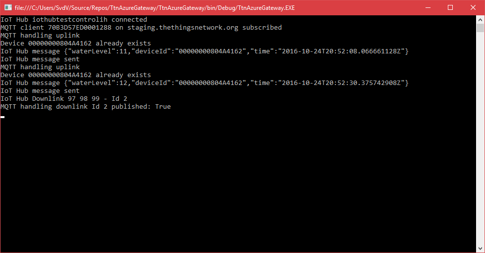
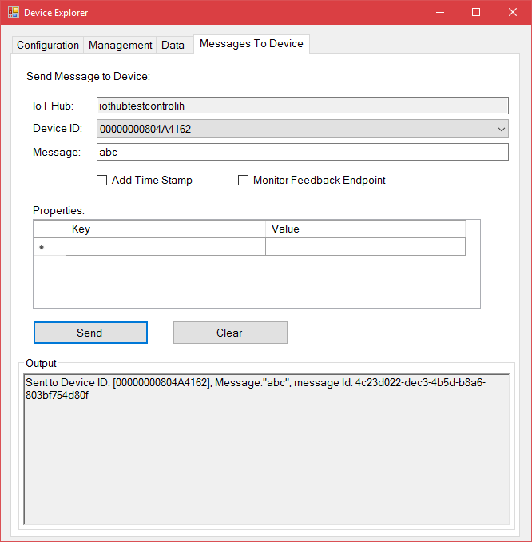
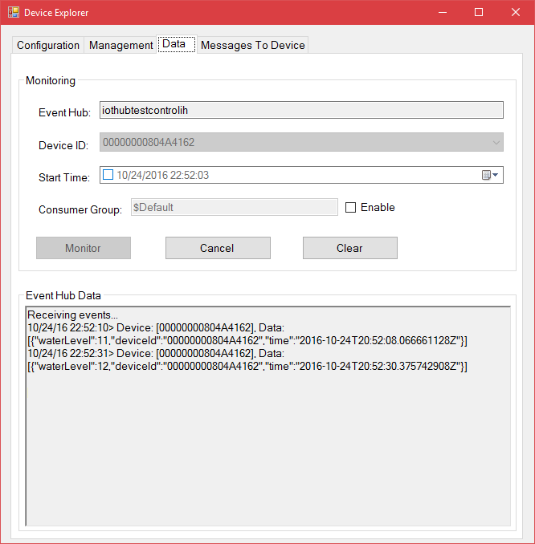

# TTN Azure Bridge

## Introduction

This is a TTN bridge for Microsoft Azure IoT Hub, written in C#. It supports both uplink and downlink. New devices are added to the Iot Hub automatically. Devices are checked for being disabled.

Just download the sourcecode and fill in the following application settings:

```xml
  <appSettings>
    <add key="BrokerHostName" value="eu.thethings.network" />
    <add key="ApplicationId" value="[TTN App Id]" />
    <add key="ApplicationAccessKey" value="[TTN App Access Key]" />
    <add key="DeviceKeyKind" value="Primary" />
    <add key="Topic" value="#" />
    <add key="ShortIotHubName" value="[iothub name]" />
    <add key="KeepAlivePeriod" value="60000" />
    <add key="ExitOnConnectionClosed" value="False" />
    <add key="RemoveDevicesAfterMinutes" value="60" />
    <add key="SilentRemoval" value="True" />
    <add key="WhiteListFileName" value="Filter\whitelist.json" />
    <add key="AddGatewayInfo" value="True"/>
  </appSettings>

  <connectionStrings>
    <add name="IoTHub" connectionString="HostName=[short iothub name].azure-devices.net;SharedAccessKeyName=iothubowner;SharedAccessKey=[shared access key]" />
  </connectionStrings>
```
*Note: This Bridge connects to TTN apps, added to https://staging.thethingsnetwork.org/applications*

## Bridge output

The bridge should support both uplink and downlink:



*Note: downlink to the devices is supported by TTN gateways and some package forwarders (like https://github.com/bokse001/dual_chan_pkt_fwd).* 

## Microsoft Azure IoT Hub Explorer - Uplink

In the next picture, uplink is shown:



## Microsoft Azure IoT Hub Explorer - Downlink

In the next picture, downlink is shown:



## Downlink

This Bridge is capable of sending downlink messages. These are command for a specific device, coming from the Azure IoT Hub. 

When a device sends a message to bridge, a deviceclient is connected to the IoT Hub. This client is then listening for commands to be send back. In the AppSettings, you can specify how long this deviceclient will exist, using the *RemoveDevicesAfterMinutes* setting.

## MQTT Connection closed

It can happen that the MQTT connection is closed, for unknown reasons. If that happens, an event handler is executed. Using the *ExitOnConnectionClosed* setting, you can specify what will happen. 

I suggest to run this bridge as an Azure Web Job and close the application if the connection is closed. The Web Job behavior is to restart the job again after a certain amount of seconds (normally 60 seconds). You can overrule the time using the setting *WEBJOBS_RESTART_TIME* in the portal (not in the app.config).    

## Azure WebJob

This bridge can be used as an Azure webJob too. Follow this [workshop](workshop-ttncsharpbridge.md) to depoy it as a WebJob.

## White list

A unique feature is a white list. Add the IDs of devices which are expected to send telemetry. All other devices are ignored (no registration, no upload of telemetry, no download of commands)

## Common mistakes

I have seen some dificulties for users so be aware:

1. Check the connection string of the IoTHub? both the name of the IoTHub, the name of the policy and the security key for this policy should be in sync!
2. Do you only see "device XYZ seen" and nothing more? Check the TTN payload functions. It seems only bytes are received, no JSON
3. Do not forget to run this as webjob in a WebApp withing running the website as 'always on' (see the  WebApp settings)
4. Do not forget to override the appsettings in the WebApp when runnig this bridge as a WebJob
5. Run this bridge as 'single instance' as a WebJob
